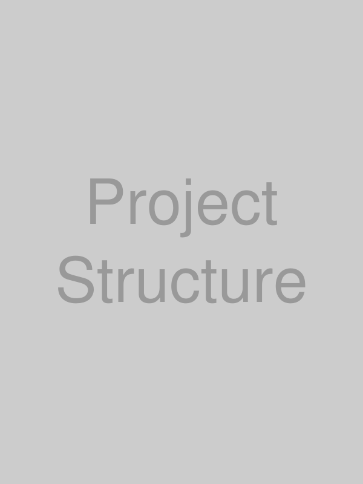
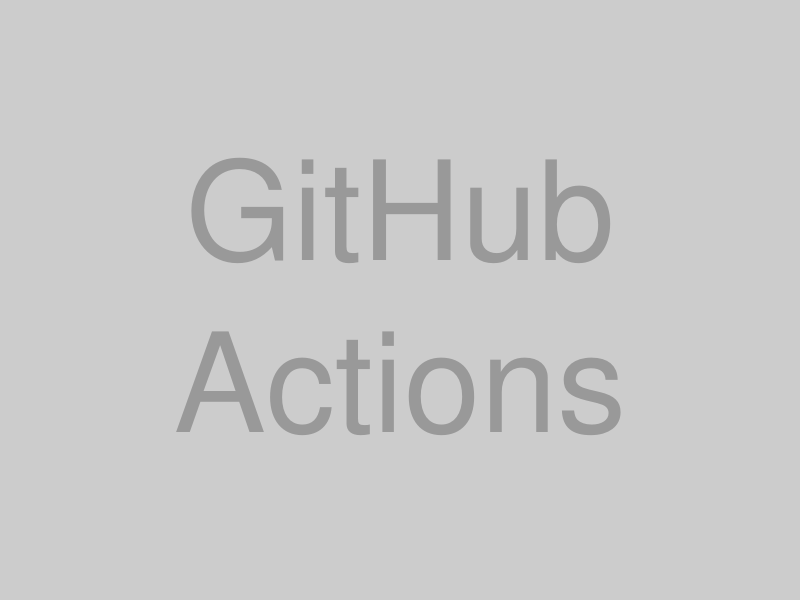
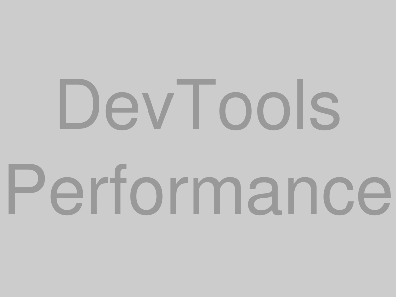

## はじめに

現代のWeb開発では、効率的なワークフローを構築することが成功の鍵となります。
開発環境のセットアップから本番デプロイまでの全工程を最適化することで、
開発速度と品質の両方を向上させることができます。
今回は、実際のスクリーンショットとともに、効率的なWeb開発ワークフローを詳しく解説します。

## 開発環境のセットアップ

### VS Codeの設定

まず、開発エディタとしてVS Codeを最適化しましょう。


上記のように、以下の設定を行います：

```json
{
  "editor.formatOnSave": true,
  "editor.codeActionsOnSave": {
    "source.fixAll.eslint": true
  },
  "editor.tabSize": 2,
  "editor.detectIndentation": false,
  "files.autoSave": "afterDelay",
  "files.autoSaveDelay": 1000
}
```

### プロジェクト構造



推奨するプロジェクト構造：

```
my-web-app/
├── .vscode/
│   ├── settings.json
│   ├── extensions.json
│   └── launch.json
├── src/
│   ├── components/
│   ├── pages/
│   ├── hooks/
│   ├── utils/
│   └── styles/
├── public/
│   ├── images/
│   └── icons/
├── tests/
│   ├── unit/
│   └── integration/
├── docs/
├── .github/
│   └── workflows/
├── package.json
├── README.md
└── .gitignore
```

## Git ワークフロー

### ブランチ戦略


Feature Branch Workflowを採用します：

```bash
# 新機能の開発開始
git checkout main
git pull origin main
git checkout -b feature/user-authentication

# 開発作業
git add .
git commit -m "feat: add login form component"
git commit -m "feat: implement authentication logic"

# プルリクエストの準備
git rebase main
git push origin feature/user-authentication
```

### コミットメッセージの規約


Conventional Commitsに従います：

```
feat: 新機能の追加
fix: バグ修正
docs: ドキュメントの更新
style: コードスタイルの変更
refactor: リファクタリング
test: テストの追加・修正
chore: その他の変更
```

## 自動化ツールの活用

### GitHub Actions設定



CI/CDパイプラインの設定：

```yaml
# .github/workflows/ci.yml
name: CI

on:
  push:
    branches: [ main, develop ]
  pull_request:
    branches: [ main ]

jobs:
  test:
    runs-on: ubuntu-latest
    steps:
      - uses: actions/checkout@v3
      
      - name: Setup Node.js
        uses: actions/setup-node@v3
        with:
          node-version: '18'
          cache: 'npm'
      
      - name: Install dependencies
        run: npm ci
      
      - name: Run tests
        run: npm test
      
      - name: Run ESLint
        run: npm run lint
      
      - name: Build project
        run: npm run build
```

### 品質チェック


静的解析ツールの設定：

```json
// .eslintrc.json
{
  "extends": [
    "eslint:recommended",
    "@typescript-eslint/recommended",
    "react-hooks"
  ],
  "rules": {
    "no-console": "warn",
    "no-unused-vars": "error",
    "prefer-const": "error"
  }
}
```

## 開発サーバーとホットリロード

### 開発環境の起動


```bash
# 開発サーバーの起動
npm run dev

# または yarn の場合
yarn dev
```

### ブラウザでの確認


開発中の画面確認のポイント：

1. **レスポンシブデザイン**: 各デバイスサイズでの表示確認
2. **パフォーマンス**: DevToolsでの読み込み速度確認
3. **アクセシビリティ**: Lighthouse監査の実行

## テスト戦略

### ユニットテスト


```javascript
// components/Button.test.js
import { render, screen, fireEvent } from '@testing-library/react';
import Button from './Button';

describe('Button component', () => {
  test('renders button with text', () => {
    render(<Button>Click me</Button>);
    expect(screen.getByText('Click me')).toBeInTheDocument();
  });

  test('calls onClick when clicked', () => {
    const handleClick = jest.fn();
    render(<Button onClick={handleClick}>Click me</Button>);
    
    fireEvent.click(screen.getByText('Click me'));
    expect(handleClick).toHaveBeenCalledTimes(1);
  });
});
```

### E2Eテスト


```javascript
// cypress/integration/user-flow.spec.js
describe('User Authentication Flow', () => {
  it('should allow user to login', () => {
    cy.visit('/login');
    cy.get('[data-testid=email-input]').type('user@example.com');
    cy.get('[data-testid=password-input]').type('password123');
    cy.get('[data-testid=login-button]').click();
    
    cy.url().should('include', '/dashboard');
    cy.get('[data-testid=welcome-message]').should('be.visible');
  });
});
```

## デバッグとパフォーマンス監視

### Chrome DevTools活用



パフォーマンス最適化のポイント：

1. **Network タブ**: リソースの読み込み時間確認
2. **Performance タブ**: レンダリング性能の分析
3. **Lighthouse**: 総合的な品質スコア確認

### エラートラッキング


```javascript
// エラートラッキングの設定
import * as Sentry from "@sentry/react";

Sentry.init({
  dsn: "YOUR_SENTRY_DSN",
  environment: process.env.NODE_ENV,
});

// エラーの自動キャッチ
function App() {
  return (
    <Sentry.ErrorBoundary fallback={ErrorFallback}>
      <MyApp />
    </Sentry.ErrorBoundary>
  );
}
```

## デプロイとホスティング

### Vercel デプロイ


```bash
# Vercel CLI でのデプロイ
npm i -g vercel
vercel login
vercel --prod
```

### 環境変数の管理


```javascript
// 本番環境での設定例
const config = {
  apiUrl: process.env.NEXT_PUBLIC_API_URL,
  analyticsId: process.env.NEXT_PUBLIC_GA_ID,
  sentryDsn: process.env.SENTRY_DSN,
};
```

## 監視とメンテナンス

### アナリティクス設定


```javascript
// Google Analytics 設定
import { gtag } from 'ga-gtag';

export function trackEvent(action, category, label, value) {
  gtag('event', action, {
    event_category: category,
    event_label: label,
    value: value,
  });
}
```

### パフォーマンス監視


Core Web Vitalsの監視：

- **LCP (Largest Contentful Paint)**: 2.5秒以下
- **FID (First Input Delay)**: 100ms以下  
- **CLS (Cumulative Layout Shift)**: 0.1以下

## 継続的改善

### コードレビュープロセス


レビューチェックリスト：

- [ ] コードの可読性と保守性
- [ ] テストカバレッジの確保
- [ ] パフォーマンスへの影響
- [ ] セキュリティの考慮
- [ ] アクセシビリティの確保

### 依存関係の管理


```yaml
# .github/dependabot.yml
version: 2
updates:
  - package-ecosystem: "npm"
    directory: "/"
    schedule:
      interval: "weekly"
    reviewers:
      - "team-leads"
```

## チーム開発でのベストプラクティス

### ドキュメント管理


重要なドキュメント：

1. **README.md**: プロジェクト概要とセットアップ手順
2. **CONTRIBUTING.md**: 開発への参加方法
3. **CHANGELOG.md**: バージョン履歴
4. **API仕様書**: エンドポイントの詳細

### コミュニケーション


効果的なコミュニケーション：

- **Daily Standup**: 日次の進捗共有
- **Code Review**: 建設的なフィードバック
- **Retrospective**: 定期的な振り返り

## まとめ

効率的なWeb開発ワークフローを構築することで：

1. **開発速度の向上**: 自動化による時間短縮
2. **品質の担保**: テストとレビューによる信頼性
3. **チーム協力**: 統一されたプロセスによる連携
4. **継続的改善**: データに基づく最適化


このワークフローを参考に、あなたのチームに最適な開発プロセスを構築してください。
継続的な改善を心がけることで、より良い開発体験と高品質なプロダクトを実現できます！ 
